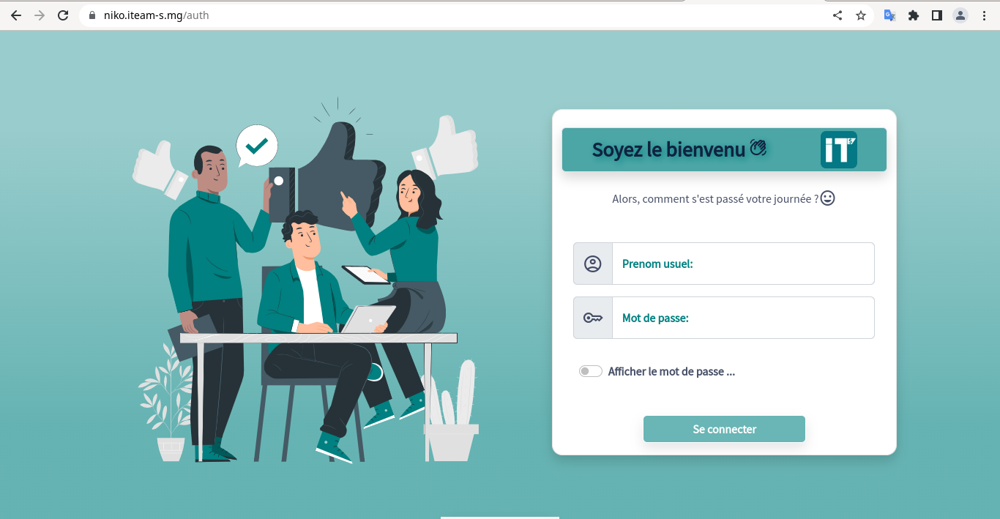
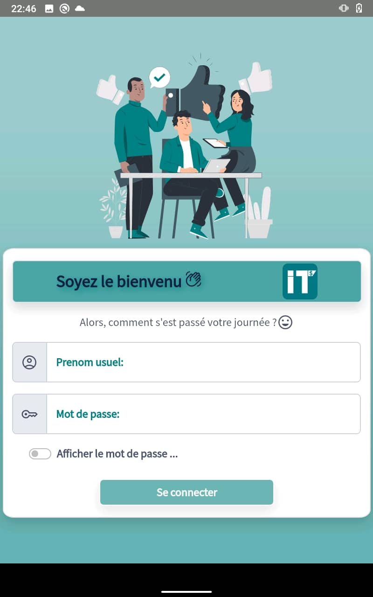
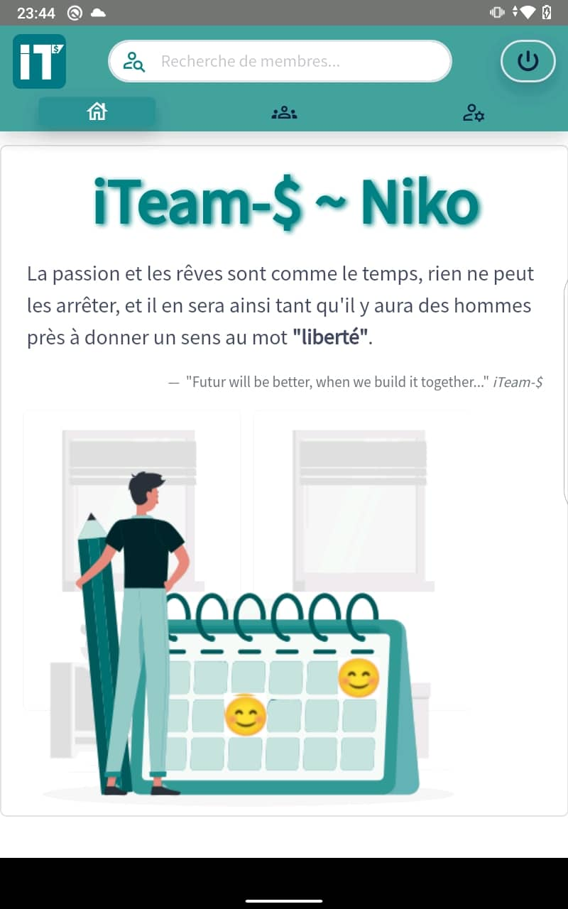
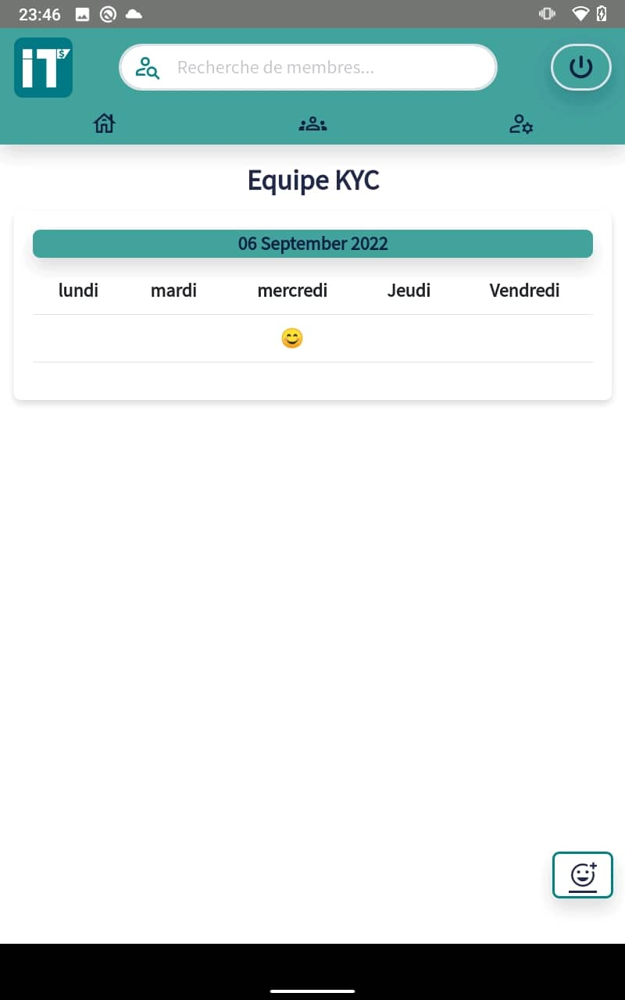
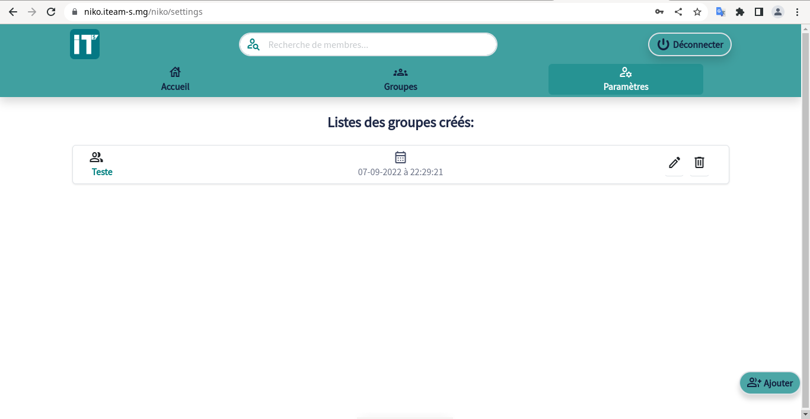
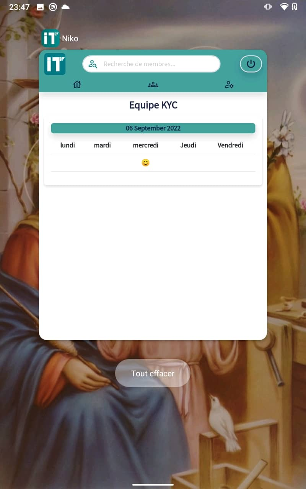

# Niko-Niko

    
    
    
    
    

- [ ] **Description:**
  - Niko-Niko est une application multi-plateforme créée par iTeam-$:
    - [web](https://niko.iteam-s.mg)
    - [mobile](https://github.com/iTeam-S/Niko-Niko/releases/tag/v1)
  - Dans le but de suivre visuellement le moral général de 
    l’équipe, dans un projet.
  - Ainsi chaque jour, durant le projet, chaque membre dans l'équipe 
    postera son humeur, et le lead du projet pourra voir l'état de son 
    équipe par semaine.
  - L'humeur de chacun sera reflète par cinq émojis qui décrive son 
    état durant la journée du projet (très heureux, heureux, ..., en colère).

- [ ] **Technologies utilisées:**
  - Les technologies que nous avons utilisées:
    - [ANGULAR](https://angular.io/): Framework front-end écrit en Typescript maintenue par Google, pour créer une application(coté client).
    - [NESTJS](https://nestjs.com/): Framework nodejs écrit en Typescript, pour la création d'une application coté serveur.
  - En gros, l'application est en full-Typescript...

  
  

- [ ] **iTeam-$ community:**
    - © 2022 Copyright: [iTeam-$](https://www.iteam-s.mg/)

  

Thanks, iTeam-$ community 